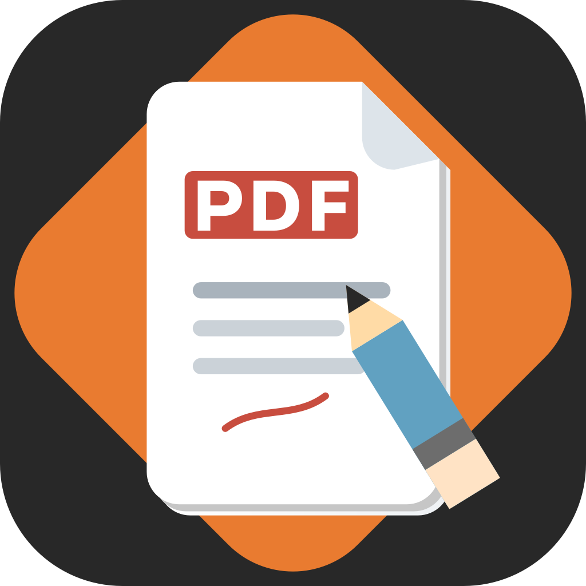

# Slate PDF Editor

A real desktop PDF editor — not a terminal tool — with **true in-place text editing**,
font detection, page organization, and OCR for scanned documents. Built with
**PySide6 (Qt)** and **PyMuPDF**, packaged as a native `.app` (macOS) and `.exe` (Windows)
with its own application icon.



## What makes the text editing "true in-place"

When you edit a line, Slate does **not** paint new text over the old text behind a white
box. It:

1. **Redacts** the original span — PyMuPDF's `apply_redactions` physically deletes the
   text-drawing operators from the page content stream. After this the original glyphs
   are *gone* (extracting text from that area returns nothing — verified in the test
   suite), and the rectangle is repainted with the **sampled background colour** so it
   blends in rather than always white.
2. **Re-inserts** your replacement at the original baseline using the original font,
   preferring (in order): the font **embedded in the PDF** → the same family **installed**
   on your system → a **metrically-close substitute** (flagged in the UI).

This is the same mechanism real editors use: the actual content of the PDF changes.

## Features

- **Edit text** — click any line; an edit box appears right over it. Enter commits, Esc cancels.
- **Structure recognition** — Slate classifies each text block as **Title / Heading /
  Paragraph / Line**. Click a paragraph and the *whole* paragraph opens for editing and
  **re-wraps within its own region** (growing downward, shrinking to fit if needed); titles
  and single lines edit individually.
- **Font detection** — Slate identifies the font behind the text you click. If it isn't
  installed it prompts you to **install** it (opens Font Book / Windows Fonts) and otherwise
  **substitutes** the closest match, telling you which.
- **Manual font selection** — the **Properties** panel (right) shows the detected style and
  lets you override **font family, size, bold/italic, colour and alignment**, then Apply —
  to the clicked text or the whole paragraph.
- **Text box** — draw a box and type **wrapping** multi-line text.
- **Page size** — set any page to an international standard (**ISO A0–A10, B0–B10, C0–C10,
  JIS B, US Letter/Legal/Ledger/Executive, ANSI A–E, ARCH A–E**) or a custom size, portrait
  or landscape, for the current page or all pages. Choose **scale-to-fit** or
  **keep-canvas** — both keep the text fully editable afterwards.
- **Add text** — drop new text anywhere, choosing font and size.
- **OCR fallback** — for non-editable / scanned pages, drag a box over the text. Slate runs
  **Tesseract**, shows you the recognized text to correct, then removes the original and
  places your corrected line in the same spot.
- **Organize pages** — thumbnail panel with **delete**, **drag-to-reorder**, **rotate**,
  **split selected pages into a new PDF**, and **split the document in two**.
- **Save / Save As / Export Copy**, multi-page navigation, zoom (Ctrl+scroll).

## Run from source

```bash
python3.10 -m venv .venv
source .venv/bin/activate            # Windows: .venv\Scripts\activate
pip install -r requirements.txt
python tools/make_icon.py            # generate the app icon
python run.py [optional.pdf]
```

OCR needs the Tesseract engine on your PATH:
- macOS: `brew install tesseract`
- Windows: install the UB-Mannheim Tesseract build, or drop a `tesseract.exe` in `vendor/`.
- Linux: `sudo apt install tesseract-ocr`

## Build a real installable app

**macOS** → `dist/Slate PDF Editor.app`:
```bash
bash packaging/build_macos.sh
# optional .dmg:
hdiutil create -volname 'Slate PDF Editor' -srcfolder 'dist/Slate PDF Editor.app' -ov -format UDZO 'dist/Slate PDF Editor.dmg'
```

**Windows** → `dist\Slate PDF Editor\`:
```bat
packaging\build_windows.bat
```
Wrap the output folder with Inno Setup or NSIS for a one-click installer.

To ship OCR inside the bundle (so users don't install Tesseract), place a `tesseract`
binary and its `tessdata` folder under `vendor/` before building; Slate auto-detects it.

## Project layout

| File | Responsibility |
|------|----------------|
| `slate/pdf_document.py` | PyMuPDF wrapper: open/save, render, text extraction, embedded-font extraction, page ops, resize |
| `slate/text_editor.py` | True in-place edit: redact + reinsert; paragraph reflow; text boxes; restyle |
| `slate/font_manager.py` | Parse PDF font names, index system fonts, detect/match/substitute |
| `slate/structure.py` | Group spans into blocks; classify Title/Heading/Paragraph/Line |
| `slate/page_sizes.py` | International page-size standards table (ISO/JIS/US/ANSI/ARCH) |
| `slate/ocr.py` | Tesseract OCR → positioned spans for the non-editable path |
| `slate/canvas.py` | Page view, click-to-edit inline + paragraph editing, text-box / OCR drag |
| `slate/pages_panel.py` | Organize-pages thumbnail panel |
| `slate/properties_panel.py` | Text Properties panel: manual font/size/style/colour/align |
| `slate/dialogs.py` | Font-install prompt, add-text, OCR review, page-size |
| `slate/main_window.py` | Wires everything together |
| `slate/app.py` | QApplication, dark theme, icon |
| `tools/make_icon.py` | Generates `icon.png/.icns/.ico` |
| `packaging/` | PyInstaller spec + build scripts |

## Honest limitations

- Redaction over a **photographic / gradient background** repaints a sampled solid colour;
  on complex backgrounds a faint patch can remain (this is hard for every PDF editor).
- OCR estimates font **size and position**; it cannot recover the exact original typeface
  from a raster, so it defaults to a clean sans family you can change.
- Reflowing a whole paragraph when text gets longer/shorter is not yet automatic — edits
  are per-line/span.
